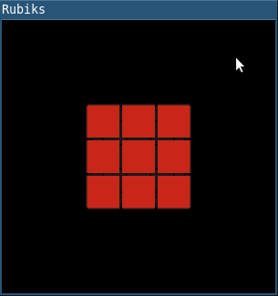

# rubiks

## Overview

This is a 3D-Rubik's cube simulator written entirely in Haskell using [Gloss](https://hackage.haskell.org/package/gloss).



## Play

The play is pretty rudimentary (it's just a Rubik's cube), but it seems to work!
* To quit the game, close the window or press Esc
* To rotate a layer of the cube, left-click on a cell in the layer and drag it to an adjacent cell in the direction that you want to rotate (see the demo animation above).
* To rotate the whole cube, left-click adjacent to the cube and drag up-down or left-right.
* To scale the cube, right-click anywhere and drag up to reduce the size or down to increase the size.
* To undo your last move, press the space bar.
* To return the cube to the solved state, press 's'. This clears all previous moves.
* To add *n* random moves to the current cube, press *n* where *n* is a digit between 0 and 9. Pressing 0 will add 10 random moves. So to add 15 random moves, press 0 then 5. Doing this will clear all previous moves, so you cannot undo it!

To display help information (including the above command list), run `rubiks --help` at the terminal.

## Installation and uninstallation

The game uses the [Haskell Tool Stack](https://docs.haskellstack.org/en/stable/README/), so to clone and compile the repository, try
```sh
git clone https://github.com/MWRuszczycky/rubiks.git
cd rubiks
stack build
```
To run the game from within the repository after building, try
```sh
stack exec rubiks
```
Alternatively, you can locally install it using
```sh
stack install
```
from within the repository and *Stack* will tell you where the binary has been placed. You should now be able to run the game from either the command line or the program menu.

To uninstall, delete the repository and the binary installed by stack if you did a local install. There are no other configuration files.

## Known issues and to-do

* The program should run on Windows and Linux. If you are using a tiling window manager (e.g., *i3*), then you may need to toggle floating mode on the window. I do not have a Mac to test *rubiks* on; however, an issue has been raised that window resizing can cause warping of the cube when running in this system. Suggestions and pull requests are welcome.
* Maybe allow user to choose their own colors?
